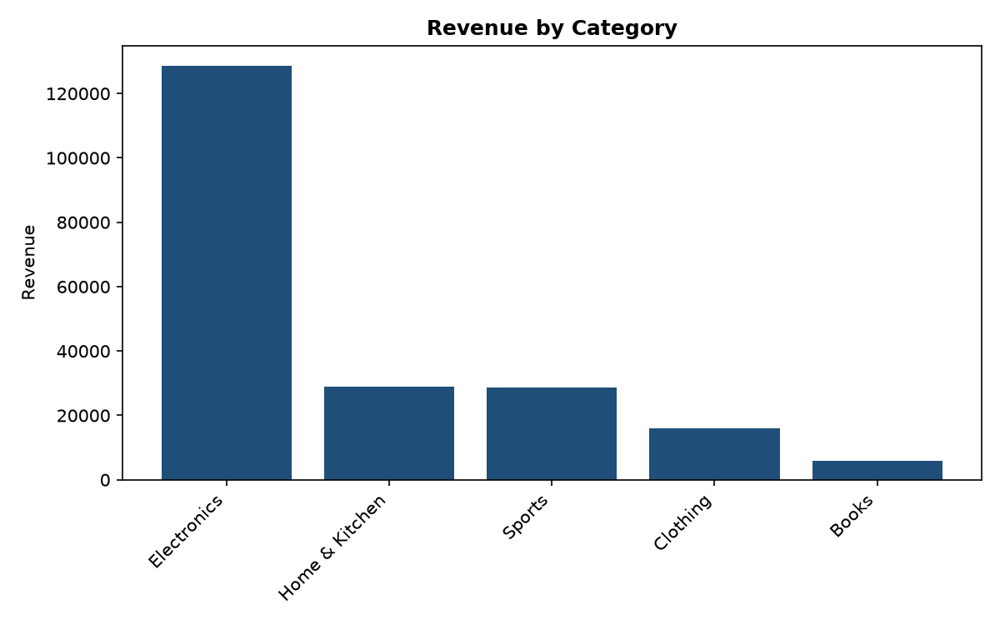
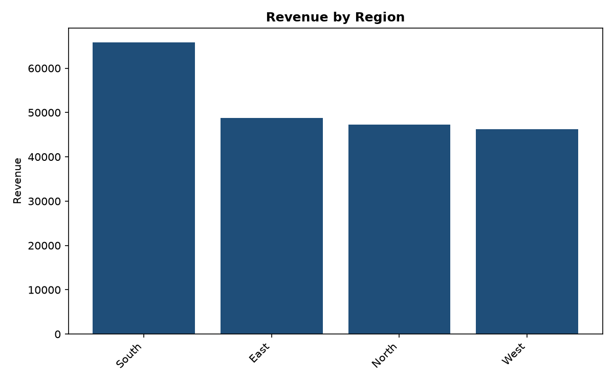
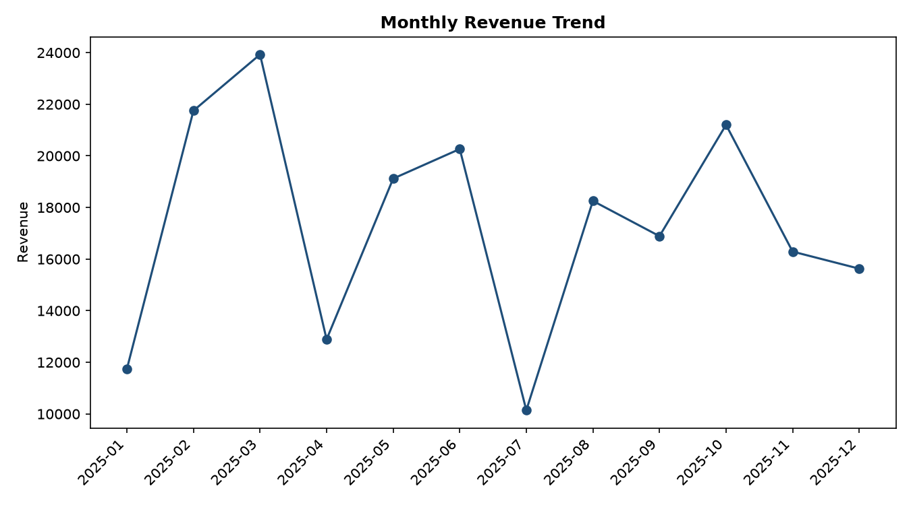

# Retail Sales Analysis

A Python pipeline that takes raw retail sales data, cleans it, calculates the key business numbers, and turns them into clear charts, all with a single command.

I built this project to practise the full workflow a data analyst follows on the job: starting from messy data, ending with insights someone else can actually use. The code is split into small, testable functions rather than one long notebook, so it is easy to read, reuse and extend.

---

## What this project answers

A sales team usually wants quick answers to questions like these:

- How much revenue did we make, and from how many orders?
- What is the average value of an order?
- Which product categories bring in the most money?
- Which regions perform best, and which are falling behind?
- How does revenue change from month to month?

This pipeline answers all of them automatically, and saves the results as charts you can drop into a report or presentation.

---

## How it works

The pipeline runs in four steps:

1. **Load.** Reads the CSV file, standardizes column names (lowercase, underscores) and checks that every required column is present. If something is missing, it stops with a clear error message instead of failing later in a confusing way.
2. **Clean.** Removes duplicate rows, converts dates and numbers to proper types, and drops rows with missing or invalid values (for example, a negative quantity or an unreadable date). It then adds two helper columns: `revenue` (quantity x unit price) and `month`.
3. **Analyze.** Calculates headline KPIs: total revenue, total orders, average order value and the top-performing category. It also groups revenue by category and by region.
4. **Visualize.** Saves three charts to the `outputs/` folder: revenue by category, revenue by region, and the monthly revenue trend.

Every step writes a short log message, so you can see exactly how many rows were loaded, how many were removed during cleaning, and where each chart was saved.

---

## Project structure

```
retail-sales-analysis/
├── data/
│   └── sample_sales.csv      # Small sample dataset (synthetic, for demo)
├── src/
│   └── analysis.py           # The full pipeline
├── tests/
│   └── test_analysis.py      # Automated tests
├── outputs/                  # Charts are saved here
├── requirements.txt
├── .gitignore
└── README.md
```

---

## Getting started

**1. Clone the repository**

```bash
git clone https://github.com/<your-username>/retail-sales-analysis.git
cd retail-sales-analysis
```

**2. (Optional) Create a virtual environment**

```bash
python -m venv .venv
source .venv/bin/activate        # On Windows: .venv\Scripts\activate
```

**3. Install the dependencies**

```bash
pip install -r requirements.txt
```

**4. Run the analysis**

```bash
python src/analysis.py
```

By default it reads `data/sample_sales.csv` and writes charts to `outputs/`. To use your own data or choose a different output folder:

```bash
python src/analysis.py --input data/my_sales.csv --output my_results
```

---

## Using your own data

Your CSV needs these five columns (the order does not matter, and extra columns are ignored):

| Column | Description | Example |
|---|---|---|
| `order_date` | Date of the order | `2025-03-14` |
| `category` | Product category | `Electronics` |
| `region` | Sales region | `North` |
| `quantity` | Units sold | `3` |
| `unit_price` | Price per unit | `249.99` |

One assumption to be aware of: each row is treated as one order, so "total orders" is simply the number of valid rows after cleaning. If your data has multiple rows per order, you would need an order ID column and a small change to the KPI function.

---

## Sample output

The charts below were generated from the included sample dataset. The sample data is synthetic and exists only so the project runs out of the box. The numbers are not real business results.







---

## Key findings

> Replace this section with what you found in your own data.

- **Top category:** (for example, which category produced the most revenue, and roughly what share of the total)
- **Regional performance:** (which region leads, which lags, and by how much)
- **Seasonality:** (any months with clear peaks or dips, and a possible reason)
- **Recommendation:** (one practical action the business could take based on the above)

---

## Running the tests

The project includes automated tests that check the cleaning logic and the KPI calculations.

```bash
pytest
```

The tests confirm that duplicates and invalid rows are removed, that revenue totals are correct, and that results are sorted from highest to lowest.

---

## Design decisions

- **Functions over one long script.** Each step (load, clean, analyze, plot) is its own function, which makes the code easier to test and reuse.
- **Fail early with clear messages.** Missing files and missing columns raise specific errors right at the start.
- **Safe type conversion.** Dates and numbers are converted with `errors="coerce"`, so a single bad value becomes a missing value that can be filtered out, instead of crashing the whole run.
- **Logging instead of print statements.** Log messages show what the pipeline is doing and are easy to filter or redirect later.
- **Command-line arguments.** Input and output paths can be changed without editing the code.

---

## Limitations and next steps

- Add a profit margin analysis once cost data is available.
- Add customer-level analysis such as repeat purchases and top customers.
- Build an interactive dashboard in Power BI or Streamlit on top of the cleaned data.
- Load the cleaned data into a MySQL database and run the same analysis with SQL queries.

---

## Tech stack

Python, pandas, Matplotlib, pytest

---

## About me

I am Zunaid, a Computer Science student building my path toward a career in data analytics. I am learning SQL, Python, Excel and Power BI, and I share my projects and learning on GitHub and LinkedIn.

- LinkedIn: add your profile link here
- GitHub: add your profile link here

Feedback and suggestions are very welcome.
